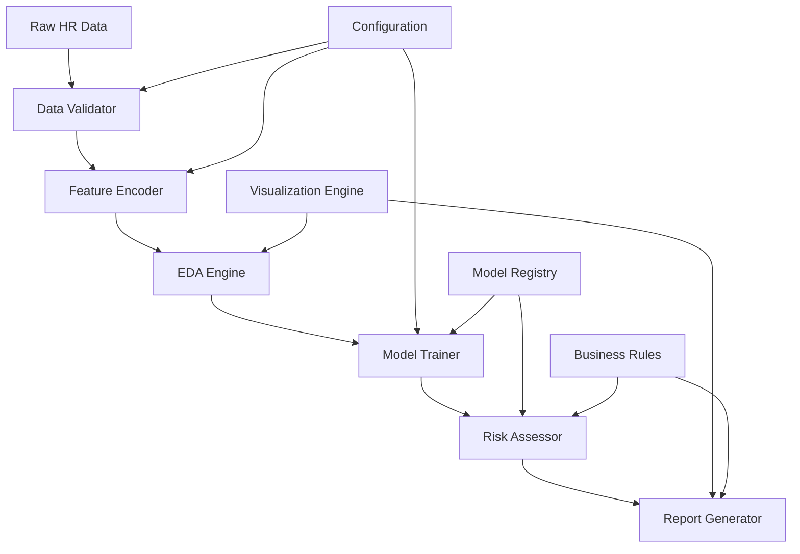

# Design Document: Employee Attrition Predictor

## Overview

The Employee Attrition Predictor is a comprehensive machine learning system that transforms HR data into actionable insights for employee retention. The system follows a data science pipeline approach, progressing from raw HR data through exploratory analysis, feature engineering, model training, and finally to executive reporting.

The architecture emphasizes interpretability and business value, combining statistical rigor with practical HR applications. The system generates both technical artifacts (trained models, analysis notebooks) and business deliverables (executive reports, watch lists) to serve different stakeholder needs.

## Architecture

The system follows a modular pipeline architecture with clear separation of concerns:



### Core Components

1. **Data Processing Layer**: Handles data validation, cleaning, and feature engineering
2. **Analysis Layer**: Performs exploratory data analysis and hypothesis testing
3. **Modeling Layer**: Trains, evaluates, and persists machine learning models
4. **Business Intelligence Layer**: Generates insights, reports, and recommendations
5. **Persistence Layer**: Manages model storage, configuration, and metadata

## Components and Interfaces

### Data Validator

**Purpose**: Ensures data quality and completeness before processing

**Interface**:
```python
class DataValidator:
    def validate_schema(self, df: pd.DataFrame) -> ValidationResult
    def check_completeness(self, df: pd.DataFrame) -> QualityReport
    def detect_outliers(self, df: pd.DataFrame) -> OutlierReport
    def validate_business_rules(self, df: pd.DataFrame) -> BusinessRuleReport
```

**Key Responsibilities**:
- Validate required columns (Age, Department, DistanceFromHome, EducationField, JobSatisfaction, MonthlyIncome, NumCompaniesWorked, YearsAtCompany, OverTime, Attrition)
- Check data types and value ranges
- Identify missing values and outliers
- Validate business logic constraints

### Feature Encoder

**Purpose**: Transforms categorical variables into machine learning-ready numerical format

**Interface**:
```python
class FeatureEncoder:
    def __init__(self, encoding_strategy: Dict[str, str])
    def fit_transform(self, df: pd.DataFrame) -> pd.DataFrame
    def transform(self, df: pd.DataFrame) -> pd.DataFrame
    def get_feature_names(self) -> List[str]
    def save_encoders(self, path: str) -> None
```

**Encoding Strategies**:
- **Ordinal Encoding**: JobSatisfaction (Low=1, Medium=2, High=3)
- **One-Hot Encoding**: Department, EducationField, JobRole (nominal categories)
- **Binary Encoding**: OverTime (Yes=1, No=0)
- **Numerical Scaling**: Age, DistanceFromHome, MonthlyIncome, NumCompaniesWorked, YearsAtCompany

### EDA Engine

**Purpose**: Generates exploratory analysis and visualizations to understand data patterns

**Interface**:
```python
class EDAEngine:
    def generate_correlation_matrix(self, df: pd.DataFrame) -> plt.Figure
    def analyze_attrition_by_feature(self, df: pd.DataFrame, feature: str) -> AnalysisResult
    def test_hypothesis(self, df: pd.DataFrame, hypothesis: str) -> HypothesisResult
    def create_distribution_plots(self, df: pd.DataFrame) -> List[plt.Figure]
    def generate_summary_statistics(self, df: pd.DataFrame) -> StatsSummary
```

**Key Analyses**:
- Correlation between DistanceFromHome and Attrition
- Attrition rates by OverTime status
- Department-wise turnover analysis
- Tenure pattern analysis (attrition spikes at 2+ years)
- Salary distribution impact on retention

### Model Trainer

**Purpose**: Trains, evaluates, and compares multiple machine learning algorithms

**Interface**:
```python
class ModelTrainer:
    def train_logistic_regression(self, X: pd.DataFrame, y: pd.Series) -> LogisticModel
    def train_random_forest(self, X: pd.DataFrame, y: pd.Series) -> RandomForestModel
    def train_decision_tree(self, X: pd.DataFrame, y: pd.Series) -> DecisionTreeModel
    def evaluate_model(self, model: BaseModel, X_test: pd.DataFrame, y_test: pd.Series) -> EvaluationMetrics
    def compare_models(self, models: List[BaseModel]) -> ComparisonReport
    def extract_feature_importance(self, model: BaseModel) -> FeatureImportance
```

**Model Implementations**:
- **Logistic Regression**: Baseline model with coefficient interpretability
- **Random Forest**: Captures non-linear relationships and feature interactions
- **Decision Tree**: Provides interpretable decision paths

**Evaluation Metrics**:
- Accuracy, Precision, Recall, F1-Score
- ROC Curves and AUC scores
- Cross-validation performance
- Feature importance rankings

### Risk Assessor

**Purpose**: Generates risk scores and identifies high-risk employees

**Interface**:
```python
class RiskAssessor:
    def calculate_risk_scores(self, df: pd.DataFrame, model: BaseModel) -> pd.DataFrame
    def generate_watch_list(self, risk_scores: pd.DataFrame, threshold: float = 0.7) -> WatchList
    def segment_by_department(self, watch_list: WatchList) -> Dict[str, WatchList]
    def prioritize_interventions(self, watch_list: WatchList) -> PriorityList
    def calculate_business_impact(self, predictions: pd.DataFrame) -> BusinessImpact
```

**Risk Scoring Logic**:
- Probability threshold of 0.7 for watch list inclusion
- Department-based risk segmentation
- Performance rating integration for prioritization
- Cost-benefit analysis for intervention planning

### Report Generator

**Purpose**: Creates executive reports and business recommendations

**Interface**:
```python
class ReportGenerator:
    def generate_executive_summary(self, analysis_results: AnalysisResults) -> ExecutiveReport
    def create_departmental_breakdown(self, risk_data: RiskData) -> DepartmentalReport
    def formulate_recommendations(self, insights: BusinessInsights) -> RecommendationList
    def generate_pdf_report(self, report_data: ReportData) -> bytes
    def create_visualizations(self, data: pd.DataFrame) -> List[plt.Figure]
```

## Data Models

### Employee Record
```python
@dataclass
class EmployeeRecord:
    employee_id: str
    age: int
    department: str
    distance_from_home: int
    education_field: str
    job_satisfaction: str  # Low, Medium, High
    monthly_income: float
    num_companies_worked: int
    years_at_company: int
    overtime: bool
    attrition: bool  # Target variable
```

### Risk Assessment
```python
@dataclass
class RiskAssessment:
    employee_id: str
    risk_score: float  # 0.0 to 1.0
    risk_category: str  # Low, Medium, High
    key_risk_factors: List[str]
    recommended_actions: List[str]
    intervention_priority: int
```

### Model Performance
```python
@dataclass
class ModelPerformance:
    model_name: str
    accuracy: float
    precision: float
    recall: float
    f1_score: float
    auc_score: float
    feature_importance: Dict[str, float]
    cross_val_scores: List[float]
```

### Business Impact
```python
@dataclass
class BusinessImpact:
    total_employees_at_risk: int
    estimated_turnover_cost: float  # Based on 200% salary rule
    potential_savings: float
    roi_projection: float
    department_breakdown: Dict[str, float]
```

Now I'll use the prework tool to analyze the acceptance criteria before writing the correctness properties:
## Correctness Properties

*A property is a characteristic or behavior that should hold true across all valid executions of a system—essentially, a formal statement about what the system should do. Properties serve as the bridge between human-readable specifications and machine-verifiable correctness guarantees.*

Based on the requirements analysis, the following correctness properties ensure the system behaves correctly across all valid inputs and scenarios:

### Property 1: Data Processing Round-Trip Consistency
*For any* valid HR dataset, after applying feature encoding and then decoding (where applicable), the semantic meaning of categorical variables should be preserved and numerical features should maintain their relative relationships.
**Validates: Requirements 1.1, 1.2, 1.3, 1.4, 1.5, 8.1, 8.2, 8.3, 8.4, 8.5**

### Property 2: Risk Score Bounds and Consistency
*For any* employee data processed through the system, all generated risk scores must fall within the range [0.0, 1.0], and employees with identical feature profiles must receive identical risk scores.
**Validates: Requirements 3.5, 5.1, 5.2**

### Property 3: Feature Importance Ranking Consistency
*For any* trained model, the feature importance rankings must be consistent with the model's actual decision-making behavior, and the top 3 features must account for a significant portion of the model's predictive power.
**Validates: Requirements 4.1, 4.2, 9.1**

### Property 4: Model Evaluation Metric Completeness
*For any* model predictions and ground truth labels, all required evaluation metrics (accuracy, precision, recall, F1-score, AUC) must be calculable and fall within their valid ranges.
**Validates: Requirements 3.4, 9.4, 9.5**

### Property 5: EDA Visualization Generation Completeness
*For any* valid HR dataset, the EDA engine must successfully generate all required visualizations (correlation matrices, distribution plots, cross-tabulations) without errors.
**Validates: Requirements 2.1, 2.2, 2.3, 2.4, 2.5**

### Property 6: Hypothesis Testing Statistical Validity
*For any* HR dataset with sufficient sample size, correlation tests between DistanceFromHome and Attrition, and attrition rate comparisons between overtime groups, must produce statistically valid results.
**Validates: Requirements 10.1, 10.2, 10.5**

### Property 7: Watch List Filtering Accuracy
*For any* set of risk scores, applying the 0.7 threshold filter must correctly identify all and only those employees with risk scores ≥ 0.7, with no false inclusions or exclusions.
**Validates: Requirements 5.2, 5.3, 5.4, 5.5**

### Property 8: Model Persistence Round-Trip
*For any* trained model, serializing the model to disk and then loading it back must produce a model that generates identical predictions on the same input data.
**Validates: Requirements 13.1, 13.2, 11.2**

### Property 9: Report Generation Content Completeness
*For any* analysis results, generated executive reports must contain all required elements (top 3 attrition drivers, departmental breakdown, recommendations, visualizations) in non-technical language.
**Validates: Requirements 6.1, 6.2, 6.3, 6.4, 6.5, 11.3, 11.5**

### Property 10: Business Impact Calculation Accuracy
*For any* employee salary data, replacement cost calculations must use exactly 200% of annual salary, and ROI calculations must correctly compare intervention costs to prevented turnover costs.
**Validates: Requirements 14.1, 14.2, 14.3, 14.5**

### Property 11: Data Quality Validation Completeness
*For any* input dataset, the data validator must detect all instances of missing required fields, invalid data types, and values outside acceptable ranges.
**Validates: Requirements 15.1, 15.2, 15.5**

### Property 12: Notebook Documentation Completeness
*For any* analysis workflow, the generated Jupyter notebook must contain markdown explanations for all major steps, methodology documentation, and result interpretations.
**Validates: Requirements 7.1, 7.2, 7.3, 7.4, 7.5, 11.1, 11.4**

### Property 13: API Response Structure Consistency
*For any* prediction request, the API must return well-formed JSON responses containing risk scores, employee IDs, and metadata in the specified structure.
**Validates: Requirements 13.5**

### Property 14: Interactive Analysis State Consistency
*For any* scenario analysis modifications to employee attributes, the system must update risk scores consistently and maintain data integrity throughout the analysis session.
**Validates: Requirements 16.1, 16.2, 16.3, 16.4, 16.5**

## Error Handling

The system implements comprehensive error handling across all components:

### Data Processing Errors
- **Missing Required Fields**: Graceful failure with detailed error messages identifying missing columns
- **Invalid Data Types**: Automatic type conversion where possible, error reporting where not
- **Outlier Detection**: Configurable handling (remove, cap, or flag) with audit trail
- **Encoding Failures**: Fallback strategies for unknown categorical values

### Model Training Errors
- **Insufficient Data**: Minimum sample size validation with clear error messages
- **Convergence Failures**: Alternative algorithm suggestions and parameter tuning
- **Memory Constraints**: Batch processing and data sampling strategies
- **Feature Selection Issues**: Automatic feature correlation analysis and redundancy removal

### Business Logic Errors
- **Invalid Risk Thresholds**: Parameter validation with business rule constraints
- **Department Mapping Failures**: Flexible department name matching with manual override options
- **Performance Rating Inconsistencies**: Data validation with business rule enforcement

### System Integration Errors
- **Model Loading Failures**: Version compatibility checks and graceful degradation
- **Report Generation Errors**: Template validation and fallback formatting
- **API Response Errors**: Structured error responses with diagnostic information

## Testing Strategy

The testing strategy employs a dual approach combining unit tests for specific scenarios and property-based tests for comprehensive coverage:

### Unit Testing Focus
- **Specific Examples**: Test known edge cases and business scenarios
- **Integration Points**: Validate component interactions and data flow
- **Error Conditions**: Verify proper error handling and recovery
- **Business Rules**: Confirm compliance with HR policies and regulations

### Property-Based Testing Configuration
- **Testing Framework**: Hypothesis (Python) for property-based testing
- **Minimum Iterations**: 100 iterations per property test for statistical confidence
- **Test Tagging**: Each property test tagged with format: **Feature: employee-attrition-predictor, Property {number}: {property_text}**
- **Data Generators**: Smart generators that create realistic HR data within business constraints

### Test Coverage Requirements
- **Data Processing**: Validate encoding, normalization, and validation across diverse datasets
- **Model Performance**: Ensure consistent evaluation metrics and feature importance extraction
- **Business Logic**: Verify risk assessment, watch list generation, and recommendation formulation
- **Integration**: Test end-to-end workflows from data input to report generation

### Performance Testing
- **Scalability**: Test with datasets ranging from 100 to 100,000 employee records
- **Memory Usage**: Monitor memory consumption during model training and prediction
- **Response Times**: Ensure API responses within acceptable business timeframes
- **Concurrent Usage**: Validate system behavior under multiple simultaneous users

The testing strategy ensures both correctness (through property-based testing) and reliability (through comprehensive unit testing) while maintaining focus on business value and user experience.